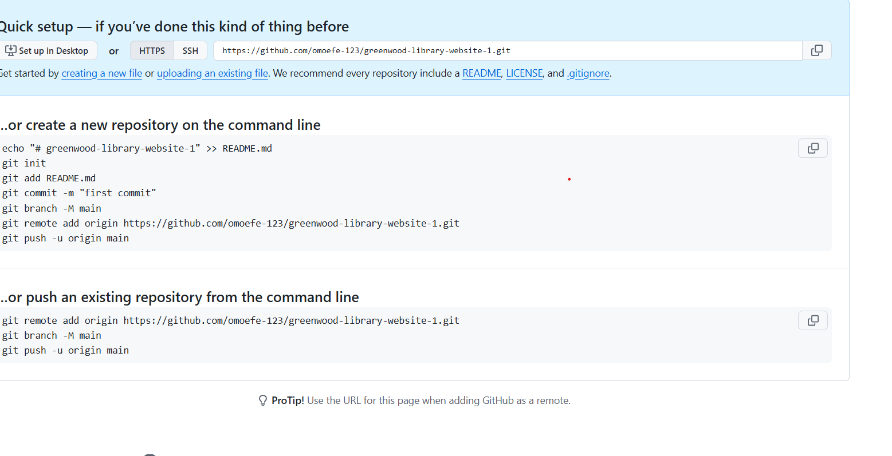
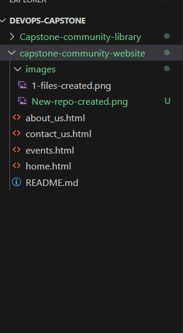
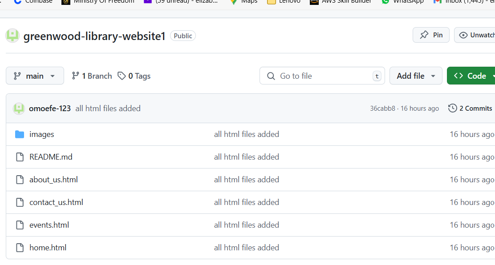

# CapStone Project: Enhancing a Community Library Website

**Background Scenario**

You're part of a development team tasked with enhancing the website for the "Greenwood Community Library." The website aims to be more engaging and informative for its visitors. It currently includes basic sections: Home, About Us, Events, and Contact Us. Your team decides to add a "Book Reviews" section and update the "Events" page to feature upcoming community events.

You will simulate the roles of two contributors: "Morgan" and "Jamie." Morgan will focus on adding the "Book Reviews" section, while Jamie will update the "Events" page with new community events.

## Project Setup
- I created a folder called greenwood-library-website in my local system
- I changed directory into it
- I created an image folder for my images
- I also created a README.md for documentation

- I then staged and commit the greenwood-library-website folder by running the following git commands:

`git add .`

`git commit -m "commit message"`

- I now went to my github acount to create a repository greenwood-library-website
- I did not now create a README.md file
- See the image below:

## Tasks
1. I created the following files as required
    - about_us.html
    - contact_us.html
    - events.html
    - home.html

2. I added content to each files
3. I now staged and commited and then pushed to my github account

 